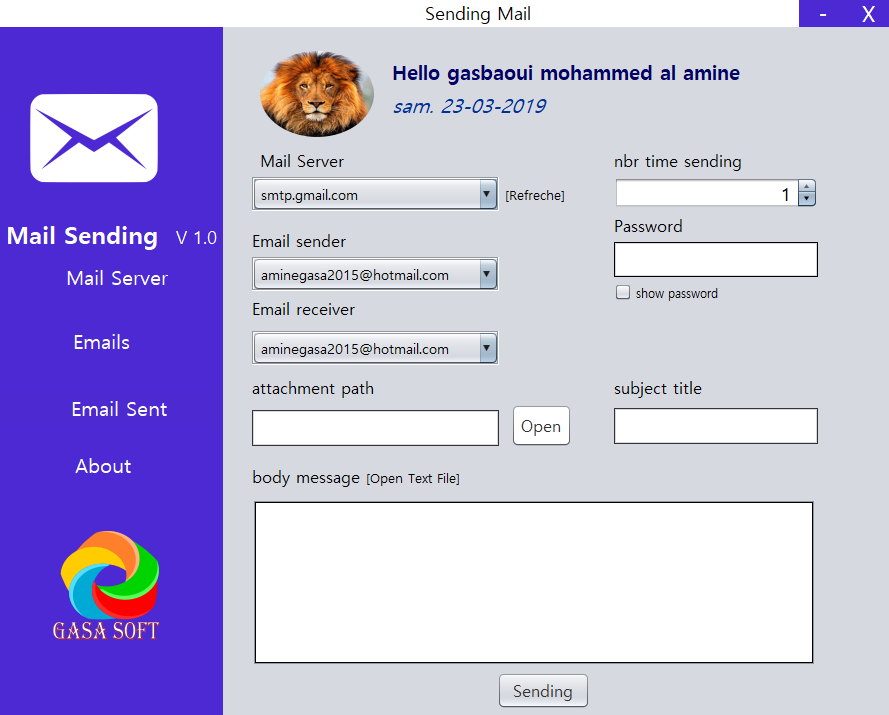
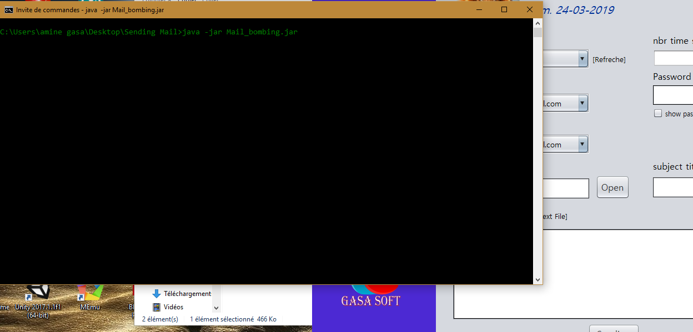

# Sending-Mail

---------------------------------------------------------------------------
# this application allows you to :
- sending messages through box mail
- you can send all type of an attachments 
- the application allows you to read a text file  for your body text mail
- you can use the application as a mail bombing (i'm not resposinble for this use)
- it 's save all out mail messages 
- you can save a copy table sent mail into pdf (the aim from this method  to delete all message sent mail)

# how i use this application :
- open cmd command line
- go to the path file sending mail 
- type this command to run the file (java -jar Mail_bombing.jar)

